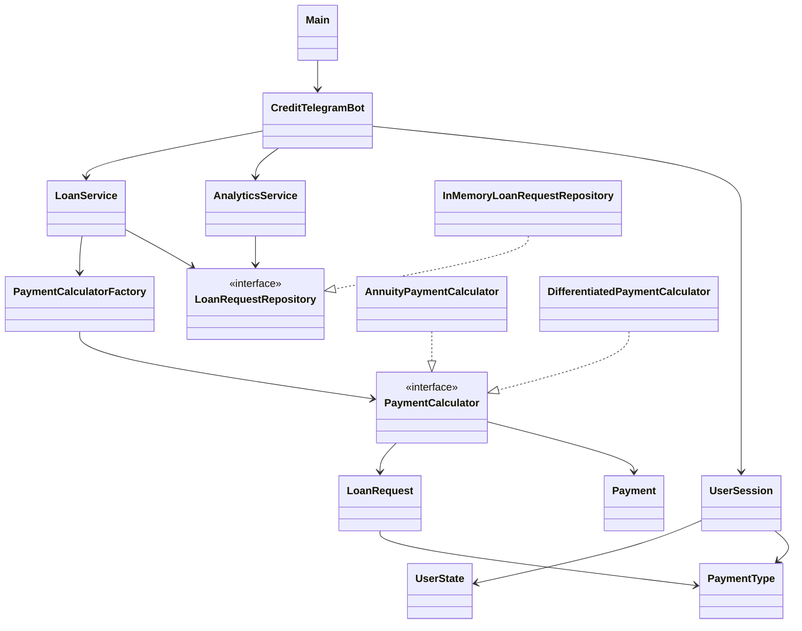

# 💳 CreditBot — кредитный калькулятор в Telegram

Telegram-бот на Java для расчёта графиков погашения кредитов.

Проект разработан в рамках учебного проекта от компании «Совкомбанк Технологии».

Бот позволяет пользователю рассчитать аннуитетный или дифференцированный график платежей, просматривать историю своих расчётов, а менеджеру — анализировать запросы пользователей и фильтровать данные.

---

## 🚀 Возможности

### 👤 Для пользователя

- расчёт кредита по команде `/calculate`;
- ввод суммы кредита;
- ввод срока кредита;
- ввод годовой процентной ставки;
- выбор типа платежа;
- расчёт аннуитетного графика;
- расчёт дифференцированного графика;
- получение помесячного графика платежей;
- отображение суммы платежа;
- отображение основного долга и процентов;
- отображение остатка задолженности;
- просмотр истории расчётов через `/history`;
- автоматическое разделение длинных графиков на несколько сообщений.

### 👩‍💼 Для менеджера

Вход в режим менеджера выполняется командой:

```text
/manager
```

После успешной авторизации доступны:

- 📊 общая аналитика;
- ⭐ статистика популярных параметров;
- 💰 фильтрация запросов по диапазону суммы кредита;
- 💳 фильтрация запросов по типу платежа;
- 🚪 выход из режима менеджера.

Доступ к менеджерской части защищён логином и паролем.

---

## 📋 Команды бота

| Команда | Описание |
|---|---|
| `/start` | Информация о боте и доступных командах |
| `/calculate` | Новый расчёт кредита |
| `/history` | История расчётов пользователя |
| `/manager` | Авторизация менеджера |
| `/analytics` | Открытие аналитики для авторизованного менеджера |

---

## 💰 Типы платежей

### Аннуитетный платёж

При аннуитетной схеме пользователь вносит примерно одинаковый платёж каждый месяц.

Для расчёта используется формула:

```text
A = P × i × (1 + i)^n / ((1 + i)^n - 1)
```

где:

- `A` — ежемесячный платёж;
- `P` — сумма кредита;
- `i` — месячная процентная ставка;
- `n` — количество месяцев.

### Дифференцированный платёж

При дифференцированной схеме основной долг делится на равные части, а проценты каждый месяц рассчитываются от оставшейся задолженности.

Поэтому размер ежемесячного платежа постепенно уменьшается.

---

## 🛠 Технологии

В проекте используются:

- Java 21;
- Maven;
- Telegram Bot API;
- библиотека TelegramBots;
- Java Collections Framework;
- IntelliJ IDEA;
- Git;
- GitHub.

Для хранения и обработки данных используются коллекции:

- `ArrayList`;
- `HashMap`;
- `HashSet`.

---

## 🏗 Архитектура проекта

Проект разделён на несколько пакетов:

```text
ru.creditbot
│
├── bot
│   ├── CreditTelegramBot
│   ├── UserSession
│   └── UserState
│
├── calculator
│   ├── PaymentCalculator
│   ├── AnnuityPaymentCalculator
│   ├── DifferentiatedPaymentCalculator
│   └── PaymentCalculatorFactory
│
├── model
│   ├── LoanRequest
│   ├── Payment
│   └── PaymentType
│
├── repository
│   ├── LoanRequestRepository
│   └── InMemoryLoanRequestRepository
│
├── service
│   ├── LoanService
│   └── AnalyticsService
│
└── Main
```

Архитектура разделяет пользовательский интерфейс, бизнес-логику, алгоритмы расчёта, модели данных и хранилище.

---

## 📐 Диаграмма классов



Диаграмма показывает основные зависимости между компонентами системы.

`CreditTelegramBot` отвечает за взаимодействие с Telegram и использует сервисы приложения.

`LoanService` выполняет основную бизнес-логику расчёта кредита.

`AnalyticsService` работает с сохранёнными запросами и формирует аналитику для менеджеров.

Алгоритмы аннуитетного и дифференцированного расчёта реализуют общий интерфейс `PaymentCalculator`.

Хранилище запросов реализует интерфейс `LoanRequestRepository`.

---

## 🧩 Применение принципов проектирования

### Abstraction — абстракция

Абстракция используется через интерфейсы:

```text
PaymentCalculator
LoanRequestRepository
```

`PaymentCalculator` определяет общий контракт для различных алгоритмов расчёта платежей.

Благодаря этому `LoanService` может работать с калькулятором независимо от конкретного алгоритма.

`LoanRequestRepository` определяет общий способ работы с хранилищем запросов.

Это позволяет при необходимости заменить хранение в оперативной памяти на другую реализацию без изменения основной бизнес-логики.

---

### Composition — композиция

Компоненты приложения строятся из других объектов с отдельными обязанностями.

Например, `LoanService` использует:

```text
PaymentCalculatorFactory
LoanRequestRepository
```

`CreditTelegramBot`, в свою очередь, использует сервисы приложения.

Таким образом, сложное поведение формируется за счёт взаимодействия нескольких специализированных компонентов, а не размещается целиком в одном классе.

---

### Low Coupling — низкая связанность

Компоненты проекта стараются минимально зависеть от внутренней реализации друг друга.

Например:

- калькуляторы платежей не зависят от Telegram API;
- repository не зависит от Telegram-бота;
- `AnalyticsService` работает с интерфейсом `LoanRequestRepository`;
- `LoanService` не зависит от конкретной реализации хранилища;
- алгоритмы расчёта реализуют общий интерфейс `PaymentCalculator`.

Благодаря этому отдельные части приложения можно изменять с минимальным влиянием на остальные компоненты.

---

### High Cohesion — высокая когезия

Основные классы проекта разделены по назначению.

Например:

- `CreditTelegramBot` — взаимодействие пользователя с Telegram-ботом;
- `LoanService` — бизнес-логика расчёта кредита;
- `AnalyticsService` — аналитика запросов;
- `PaymentCalculatorFactory` — выбор алгоритма расчёта;
- `AnnuityPaymentCalculator` — аннуитетный расчёт;
- `DifferentiatedPaymentCalculator` — дифференцированный расчёт;
- `InMemoryLoanRequestRepository` — хранение запросов;
- `LoanRequest` — данные кредитного запроса;
- `Payment` — данные одного ежемесячного платежа.

Такое разделение делает структуру проекта понятнее и упрощает изменение отдельных компонентов.

---

## 🧱 SOLID

В проекте применяются базовые принципы SOLID.

### Single Responsibility Principle

Основная логика разделена между классами с разными обязанностями.

Расчёты, аналитика и хранение данных вынесены в отдельные компоненты.

### Open/Closed Principle

Для добавления нового алгоритма расчёта можно создать новый класс, реализующий интерфейс `PaymentCalculator`.

Существующие реализации аннуитетного и дифференцированного расчёта при этом не требуется переписывать.

### Dependency Inversion Principle

Сервисы могут работать через абстракции.

Например, `LoanService` и `AnalyticsService` используют интерфейс `LoanRequestRepository`, а не зависят исключительно от конкретной реализации `InMemoryLoanRequestRepository`.

---

## 🏭 Factory Pattern

Для выбора алгоритма расчёта используется класс:

```text
PaymentCalculatorFactory
```

Он создаёт необходимый калькулятор в зависимости от выбранного пользователем типа платежа.

Калькуляторы:

```text
AnnuityPaymentCalculator
DifferentiatedPaymentCalculator
```

реализуют общий интерфейс:

```text
PaymentCalculator
```

Благодаря этому выбор конкретного алгоритма вынесен из основной бизнес-логики.

---

## ✨ YAGNI, DRY и KISS

### YAGNI

В проект не добавляется функциональность, которая не требуется текущим заданием.

### DRY

Общая логика вынесена в отдельные классы и методы, чтобы уменьшить дублирование кода.

Например, разные алгоритмы расчёта используют единый интерфейс `PaymentCalculator`.

### KISS

Архитектура проекта остаётся достаточно простой: Telegram-бот передаёт данные сервисам, сервисы используют калькуляторы и repository, а результаты возвращаются пользователю.

---

## 📊 Аналитика

Менеджер может анализировать расчёты, выполненные пользователями во время работы приложения.

Доступны:

- общее количество запросов;
- количество аннуитетных расчётов;
- количество дифференцированных расчётов;
- наиболее популярный тип платежа;
- популярный срок кредита;
- популярная процентная ставка;
- фильтрация по диапазону суммы кредита;
- фильтрация по типу платежа.

Доступ к аналитике предоставляется только после успешной авторизации менеджера.

---

## 💾 Хранение данных

Для управления данными используется абстракция:

```text
LoanRequestRepository
```

Текущая реализация:

```text
InMemoryLoanRequestRepository
```

хранит запросы пользователей в коллекции во время работы приложения.

Это позволяет:

- сохранять выполненные расчёты;
- получать историю конкретного пользователя;
- получать все запросы для аналитики менеджера;
- выполнять фильтрацию и агрегацию данных.

Текущая версия использует хранение в оперативной памяти, поэтому после перезапуска приложения данные очищаются.

Архитектура repository позволяет в дальнейшем заменить эту реализацию на файловое хранение или базу данных без изменения основной бизнес-логики.

---

## 🔐 Безопасность

Секретные данные не хранятся непосредственно в исходном коде.

Для них используются переменные окружения:

```text
BOT_TOKEN
MANAGER_LOGIN
MANAGER_PASSWORD
```

`BOT_TOKEN` используется для подключения приложения к Telegram.

`MANAGER_LOGIN` и `MANAGER_PASSWORD` используются для авторизации менеджера.

Реальные значения этих переменных не должны добавляться в GitHub.

Служебные файлы IDE, результаты сборки и файлы с переменными окружения исключены через `.gitignore`.

---

## ▶️ Запуск проекта

### 1. Требования

Для запуска необходимы:

- JDK 21 или новее;
- Maven;
- Telegram-бот, зарегистрированный через BotFather.

### 2. Переменные окружения

Перед запуском необходимо задать:

```text
BOT_TOKEN=your_bot_token
MANAGER_LOGIN=your_manager_login
MANAGER_PASSWORD=your_manager_password
```

Реальные токены и пароли не следует записывать непосредственно в исходный код.

### 3. Сборка проекта

В корневой директории проекта выполнить:

```bash
mvn clean package
```

При успешной сборке Maven выведет:

```text
BUILD SUCCESS
```

### 4. Запуск

Необходимо запустить класс:

```text
ru.creditbot.Main
```

После успешного запуска приложение выведет:

```text
Кредитный бот успешно запущен!
```

---

## 📌 Пример использования

Пользователь отправляет:

```text
/calculate
```

Бот последовательно запрашивает:

```text
Сумма кредита
↓
Срок кредита
↓
Процентная ставка
↓
Тип платежа
```

Например:

```text
Сумма: 500000 ₽
Срок: 12 месяцев
Ставка: 15%
Тип: Аннуитетный
```

После ввода параметров бот рассчитывает и отправляет пользователю помесячный график погашения кредита.

---

## 📚 Основные классы

### `Main`

Точка входа в приложение. Получает токен из переменной окружения и запускает Telegram-бота.

### `CreditTelegramBot`

Обрабатывает сообщения и команды Telegram, управляет диалогом с пользователем и менеджером.

### `UserSession`

Хранит данные текущего диалога пользователя.

### `UserState`

Определяет этап, на котором находится пользователь во время взаимодействия с ботом.

### `LoanRequest`

Содержит параметры кредитного запроса пользователя.

### `Payment`

Содержит информацию об одном ежемесячном платеже.

### `PaymentType`

Определяет тип платежа: аннуитетный или дифференцированный.

### `PaymentCalculator`

Общий интерфейс алгоритмов расчёта.

### `AnnuityPaymentCalculator`

Реализует расчёт аннуитетного графика.

### `DifferentiatedPaymentCalculator`

Реализует расчёт дифференцированного графика.

### `PaymentCalculatorFactory`

Выбирает необходимый алгоритм расчёта.

### `LoanService`

Выполняет бизнес-логику расчёта кредита и сохраняет запросы.

### `AnalyticsService`

Выполняет агрегацию, фильтрацию и анализ запросов.

### `LoanRequestRepository`

Интерфейс хранилища запросов.

### `InMemoryLoanRequestRepository`

Реализация хранилища запросов в оперативной памяти.

---

## 📌 Статус проекта

Реализованы:

- пользовательский интерфейс Telegram-бота;
- команды `/start`, `/calculate` и `/history`;
- аннуитетный расчёт;
- дифференцированный расчёт;
- помесячный график платежей;
- история запросов пользователя;
- авторизация менеджера;
- агрегированная аналитика;
- фильтрация по сумме;
- фильтрация по типу платежа;
- статистика популярных параметров;
- обработка длинных графиков платежей;
- безопасное хранение токена и данных менеджера через переменные окружения;
- Factory Pattern;
- интерфейсы для абстракции компонентов;
- разделение проекта на bot, service, repository, calculator и model;
- диаграмма основных классов проекта.

---

## 👩‍💻 Автор

Учебный проект по Java.

**Проект:** Telegram-бот для расчёта графиков погашения кредитов.